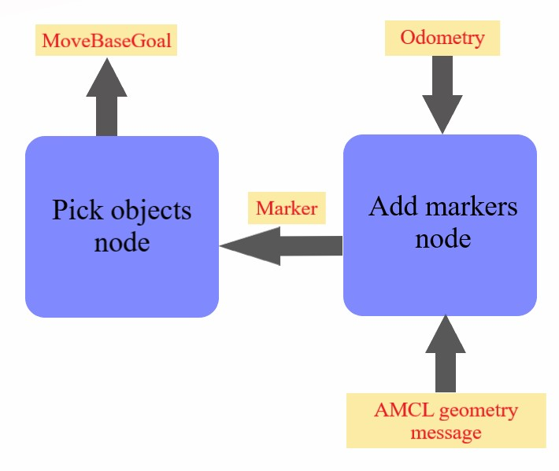

# Home Service Robot
In this project the turtlebot robot is used to simulate moving to a pickup target, then pick up an objet and eventually deliver the object to the dropping location.
## Project Contents
-  Project world.
- Add markers package which contains the "add_markers" node.
- Pick obects package which contains the "pick_objects" node.
- Many scripts to start different functions in the project. These functions are: SLAM Testing, robot navigation testing, testing picking objects from one location and deliver it to another location, testing add virtual markers, and the home service robot.
- ROS built-in package that needed to perform the simulation
## Project Description
The main functions of the project are included in "Pick objects" package and "Add markers" package.
### Pick objects package
This package do two different functions, depending on terminal command parameters. The first one is simulating moving the robot to pick up location and then to the dropping location. The second is recieving the pick up location and move the robot, pick the object and then move the robot to the droppig location, which is also recieved from another node.
### Add markers package
This package also perform two different functions, depending on the terminal command parameters. The first functions it simulate showing markers on the pick up locations wait for few seconds and the show the marker on the dropping location. The second function is publishing the markers location for the home service robot.
## Applying the home service robot.

As it illustrated in the block diagram. The [Add markers] package subscribe to AMCL positioning message and read the robot location. It also subscribe to odometry message and reads the robot velocity to know if it's moving or not. Then it sets the pick up location, which is actually the marker location, and send it to the [Pick objects] package, which in turn analyse the message, if it's for picking up or dropping.
When the robot reaches the pick up location and stops there the [add markers] package sends the drop location. After that it waits and analyse the AMCL position and robot velocity until the turtlebot reaches the drop location and stops there.  